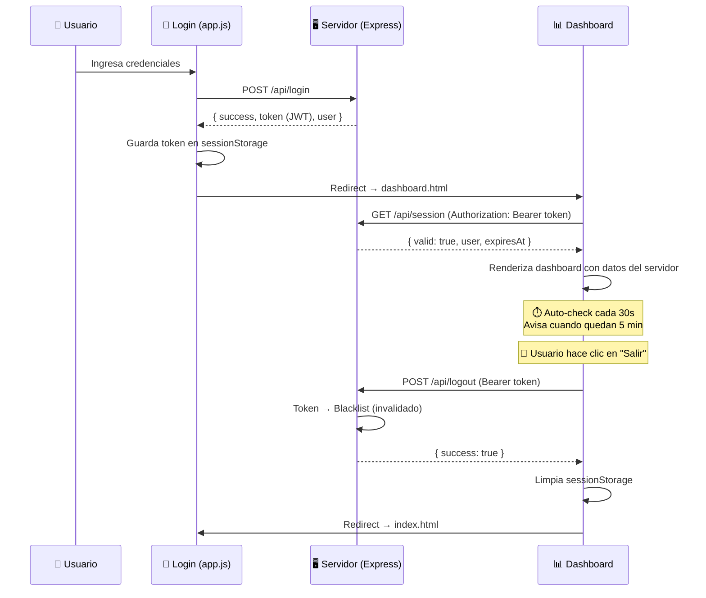
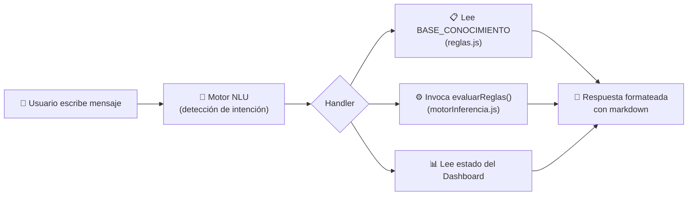

# Secure & Interactive AI Login 🧠🔒

Un sistema de inicio de sesión moderno con **Sistema Experto**, **Chatbot IA**, sesiones **JWT** y detección de fraude — construido con **HTML5, CSS3 (Vanilla), JavaScript** y backend **Node.js + Express**.


---

## 📋 Requisitos Previos

### Entorno de Desarrollo Local (Node.js)
- [Node.js](https://nodejs.org/) v16 o superior
- npm (incluido con Node.js)

### Entorno de Producción VPS (Python)
- Python 3.8 o superior
- Gunicorn
- pip

## 🚀 Instalación y Ejecución

### Opción 1: Desarrollo Local (Node.js)
```bash
# 1. Clonar el repositorio
git clone https://github.com/0x0055500l/IA_LOGIN.git
cd IA_LOGIN

# 2. Instalar dependencias
npm install

# 3. Iniciar el servidor
node server.js
```
El servidor se levantará en **http://localhost:3000**. Abre esa URL en tu navegador.

### Opción 2: Producción en VPS (Python/Flask con Gunicorn)
Ideal para servidores en la nube (ej. Azure) que ya tienen un entorno Python/Gunicorn, evitando instalar Node.js.

```bash
# 1. Instalar requerimientos de Python
pip3 install -r requirements.txt

# 2. Iniciar servidor en segundo plano (puerto 8001)
gunicorn --bind 0.0.0.0:8001 app:app --daemon
```

---

## 🛡️ Robustez en Producción (Zero CORS)

Para asegurar que el sistema funcione a la perfección detrás de proxies, redes corporativas estrictas, bloqueadores de rastreo (Tracking Prevention) o AdBlockers, el proyecto ha sido configurado para ser **100% autónomo**.
Todas las dependencias críticas de terceros se sirven localmente desde la carpeta `assets/`:
- **Fuentes (Outfit):** Descargadas desde Google Fonts (.ttf).
- **Librerías (intl-tel-input):** JavaScript, CSS e imágenes de banderas auto-alojadas, garantizando el formateo de números en cualquier red.

---

## 🔑 Credenciales de Prueba

La autenticación se valida en el **servidor** (no en el navegador). Usa estas credenciales:

| Correo | Contraseña | Rol |
|--------|------------|-----|
| `test@test.com` | `Test1234!` | Usuario Demo |
| `admin@sistema.hn` | `Admin2024!` | Administrador |

*Cualquier otra combinación simulará un fallo de inicio de sesión para que puedas probar las animaciones de error y el sistema de bloqueo.*

---

## 🔐 Flujo de Seguridad de Sesión (JWT)

El sistema implementa un flujo completo de autenticación basado en **JSON Web Tokens (JWT)** con protección en cada etapa:



### Características de la sesión

| Característica | Detalle |
|---------------|---------|
| **Generación** | JWT firmado con secret aleatorio por instancia del servidor |
| **Expiración** | 1 hora (`exp` en el payload) |
| **Almacenamiento** | `sessionStorage` (se borra al cerrar la pestaña) |
| **Validación** | Middleware `authenticateToken()` en cada ruta protegida |
| **Logout** | Token agregado a blacklist del servidor (invalidación inmediata) |
| **Auto-expiry** | Dashboard verifica cada 30s, redirige si expiró |
| **Protección de ruta** | Acceso a `dashboard.html` sin token → redirige al login |

---

## 🤖 Chatbot IA — Sistema Experto Conversacional

El dashboard incluye un **Asistente IA** que actúa como interfaz conversacional del sistema experto. Funciona **100% sin APIs externas**, utilizando directamente la base de conocimiento (`reglas.js`) y el motor de inferencia (`motorInferencia.js`).

### Acceso al chatbot
- **Botón FAB** flotante (esquina inferior derecha del dashboard)
- **"Asistente IA"** en la barra lateral de navegación

### Capacidades (13 intenciones reconocidas)

| Intención | Ejemplo de pregunta | Qué hace |
|-----------|-------------------|----------|
| 📋 Explicar regla | *"¿Qué es la regla R3?"* | Muestra condición, acción, tipo y explicación |
| 📚 Listar reglas | *"Lista todas las reglas"* | Muestra las 6 reglas con íconos por tipo |
| 🔬 Evaluar escenario | *"¿Qué pasa si tengo 5 intentos fallidos?"* | Ejecuta `evaluarReglas()` y muestra nivel de riesgo, decisión y reglas activadas |
| 📊 Riesgo actual | *"¿Cuál es el nivel de riesgo?"* | Lee el estado del dashboard en tiempo real |
| 🛡️ Seguridad | *"Consejos de seguridad"* | Tips aleatorios de seguridad bancaria |
| 🔐 OTP / 2FA | *"¿Qué es autenticación de dos factores?"* | Explica OTP y cuándo se solicita |
| 📱 Dispositivos | *"¿Cómo funciona el registro de dispositivos?"* | Explica reglas R5 (registrado) y R6 (desconocido) |
| 🔒 Bloqueos | *"¿Cuándo se bloquea la cuenta?"* | Explica R3 (temporal) y R4 (total) |
| 🕵️ Fraude | *"¿Cómo detecta el fraude?"* | Detalla scoring antifraude con puntajes |
| ⚙️ Sistema | *"¿Cómo funciona el sistema experto?"* | Info del motor de inferencia y forward chaining |
| ❓ Ayuda | *"Ayuda"* | Menú completo de capacidades |
| 👋 Saludo | *"Hola"* | Saludo personalizado con nombre del usuario |
| 👋 Despedida | *"Adiós"* | Despedida cortés |

### Arquitectura del chatbot



---

## 🎨 Características de Diseño (UI/UX)

- **Glassmorphism:** Efectos de cristal esmerilado que brindan profundidad y elegancia a la interfaz.
- **Tipografía Premium:** Uso de la fuente "Outfit" para asegurar una lectura limpia y un aspecto futurista.
- **Scroll Responsivo:** La interfaz se adapta a cualquier tamaño de pantalla con scroll vertical funcional.
- **Interactividad Canvas:** 
  - **Fondo Neuronal Magnético:** Partículas flotantes que se conectan entre sí y reaccionan de manera "magnética" a la posición del cursor, formando una red neuronal dinámica.
  - **Logo IA Giratorio:** Un núcleo geométrico posicionado sobre el mensaje de bienvenida que simula las conexiones de una IA y que se inclina sutilmente siguiendo el movimiento del ratón.
- **Cursor Dinámico (Logo Flotante):** Un núcleo brillante adicional que persigue al cursor del usuario de manera fluida usando interpolación lineal (Lerp).
- **Chatbot Drawer:** Panel flotante con burbujas de chat, typing indicator animado y scroll suave.

## 🛡️ Verificación Antifraude (Panel Colapsable)

Debajo del formulario de login se encuentra un panel colapsable **"🛡️ Verificación Antifraude"** que integra:

- **Reconocimiento Facial:** Activa la cámara web del dispositivo para capturar un rostro y verificarlo.
- **Motor de Inferencia:** Evalúa reglas expertas basadas en monto, hora, ubicación y verificación facial.
- **Análisis de Riesgo:** Clasifica la transacción como riesgo bajo, medio o alto.

> Este panel es independiente del login y se abre/cierra con un clic para no interferir con el flujo de inicio de sesión.

## 🔐 Características de Seguridad

### Del lado del Servidor
1. **Autenticación Server-Side:** Las credenciales se validan en el backend, nunca se exponen al navegador.
2. **Sesiones JWT:** Tokens firmados con expiración de 1 hora, validación en cada request protegido, y blacklist al cerrar sesión.
3. **Rate Limiting por IP:** Después de 5 intentos fallidos, la IP se bloquea durante 60 segundos.
4. **API REST protegida:** Endpoints sensibles requieren `Authorization: Bearer <token>`.

### Del lado del Cliente
5. **Anti-DevTools e Inspector:**
   - Desactiva el clic derecho (Menú contextual).
   - Bloquea atajos de teclado críticos (`F12`, `Ctrl+Shift+I/J/C`, `Ctrl+U`).
   - Implementa un bucle `debugger` que interrumpe la ejecución si se fuerzan las herramientas de desarrollador.
6. **Protección contra Fuerza Bruta (Doble Capa):**
   - Bloqueo server-side por IP (5 intentos → 60s de bloqueo).
   - Bloqueo client-side complementario con `localStorage` (3 intentos → 30s).
7. **Validación Avanzada en Tiempo Real:**
   - **Teléfono Internacional Inteligente:** Campo telefónico con detección automática de país por código de área (ej. `+504` → Honduras). Valida longitud y formato en tiempo real.
   - **Validación Profunda de Correo:** Soporta dominios complejos (`.com.hn`). Simula verificación MX del servidor antes de enviar.
   - Sanitización de entradas contra inyección de código (XSS).
   - Barra de fortaleza de contraseña en tiempo real.
8. **Honeypot Anti-Bot:** Campo oculto que, si un bot lo llena, cancela silenciosamente el envío.
9. **Anti-Clickjacking:** Protección para evitar que la página se incruste en un `iframe` malicioso.
10. **Política de Seguridad de Contenido (CSP):** Controla qué recursos puede cargar el navegador.

---

## 📁 Estructura del Proyecto

```
IA_LOGIN/
├── assets/               # Librerías locales y tipografías (Evita bloqueos CORS/AdBlock)
├── index.html            # Página de login
├── styles.css            # Estilos (glassmorphism, responsivo)
├── app.js                # Lógica del cliente (validación, animaciones, JWT storage)
├── server.js             # Backend Express (Node.js)
├── app.py                # Backend Producción (Python + Flask)
├── requirements.txt      # Dependencias de Python
├── reglas.js             # Base de conocimiento del sistema experto
├── motorInferencia.js    # Motor de inferencia
├── chatbot.js            # 🤖 Chatbot IA conversacional
├── dashboard.html        # Panel post-login
├── dashboard.css         # Estilos del dashboard
├── dashboard.js          # Lógica del dashboard
└── package.json          # Dependencias Node.js
```
IA_LOGIN/
├── index.html            # Página de login
├── styles.css            # Estilos (glassmorphism, responsivo)
├── app.js                # Lógica del cliente (validación, animaciones, JWT storage)
├── server.js             # Backend Express (JWT, login, fraud-check, rate limiting)
├── reglas.js             # Base de conocimiento del sistema experto (6 reglas)
├── motorInferencia.js    # Motor de inferencia (forward chaining)
├── chatbot.js            # 🤖 Chatbot IA conversacional (NLU + sistema experto)
├── dashboard.html        # Panel post-login (protegido con JWT)
├── dashboard.css         # Estilos del dashboard + chatbot
├── dashboard.js          # Lógica del dashboard (validación de sesión, logout)
├── package.json          # Dependencias (express, cors, jsonwebtoken)
└── README.md             # Este archivo
```

---

## 🌐 API Endpoints

| Método | Ruta | Auth | Descripción |
|--------|------|:----:|-------------|
| `GET` | `/` | ❌ | Sirve la página de login |
| `POST` | `/api/login` | ❌ | Autentica usuario → retorna JWT |
| `GET` | `/api/session` | 🔒 | Valida sesión JWT activa |
| `POST` | `/api/logout` | 🔒 | Invalida token (blacklist) |
| `POST` | `/api/fraud-check` | 🔒 | Evalúa riesgo antifraude |
| `POST` | `/api/chat` | 🔒 | Valida sesión para el chatbot |
| `GET` | `/health` | ❌ | Health check del servidor |

> 🔒 = Requiere header `Authorization: Bearer <token>`

---

*Desarrollado (GRUPO 3) - UTH San pedro sula 2026 - INTELIGENCIA ARTIFICIAL*
