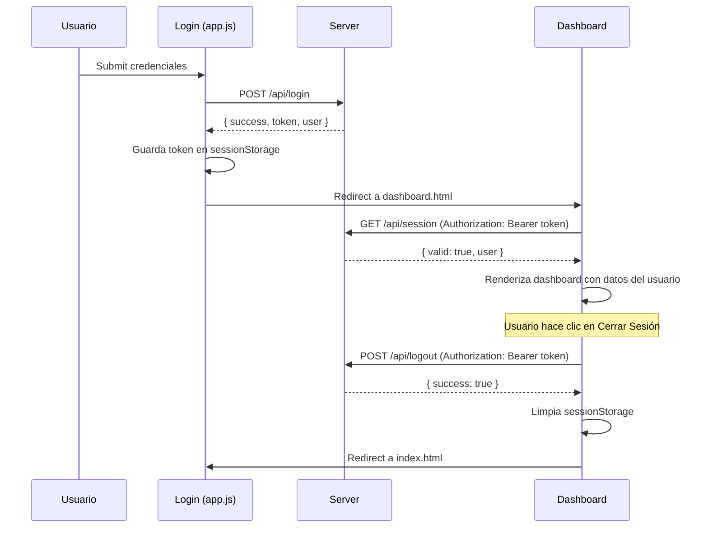

# Sesiones Seguras + Chatbot IA con Sistema Experto

## Resumen

Tres features interconectadas:
1. **Sesiones seguras con JWT** — proteger el dashboard con tokens, validación server-side, y cerrar sesión
2. **Botón de chatbot** en la barra lateral del dashboard
3. **Chatbot IA** que usa la base de conocimiento de [reglas.js](file:///c:/Users/Alejandro/Desktop/IA_LOGIN/reglas.js) y el [motorInferencia.js](file:///c:/Users/Alejandro/Desktop/IA_LOGIN/motorInferencia.js) para responder preguntas sobre seguridad, fraude y el estado del sistema

---

## Proposed Changes

### Componente 1: Sesiones Seguras con JWT

#### [MODIFY] [server.js](file:///c:/Users/Alejandro/Desktop/IA_LOGIN/server.js)

- Instalar `jsonwebtoken` como dependencia
- Generar JWT al hacer login exitoso (con `email`, `name`, `iat`, `exp` de 1 hora)
- Crear middleware `authenticateToken()` que valide el JWT en cada request protegido
- Nuevo endpoint `GET /api/session` para que el dashboard valide su sesión al cargar
- Nuevo endpoint `POST /api/logout` (invalida token agregándolo a una blacklist en memoria)
- Proteger `/api/fraud-check` y `/api/session` con el middleware de autenticación

#### [MODIFY] [app.js](file:///c:/Users/Alejandro/Desktop/IA_LOGIN/app.js)

- Al recibir login exitoso, guardar el JWT en `sessionStorage` (no localStorage — más seguro, se borra al cerrar pestaña)
- Redirigir al dashboard con el token disponible

#### [MODIFY] [dashboard.js](file:///c:/Users/Alejandro/Desktop/IA_LOGIN/dashboard.js)

- Al cargar: llamar a `GET /api/session` con el JWT para validar la sesión
- Si el token es inválido o expirado → redirigir al login
- Mostrar nombre del usuario desde la respuesta del servidor (no de localStorage)
- Función `cerrarSesion()` que llama a `POST /api/logout`, limpia `sessionStorage`, y redirige al login

#### [MODIFY] [dashboard.html](file:///c:/Users/Alejandro/Desktop/IA_LOGIN/dashboard.html)

- Agregar botón "Cerrar Sesión" en el topbar junto al pill del usuario

---

### Componente 2: Botón Chatbot en Sidebar

#### [MODIFY] [dashboard.html](file:///c:/Users/Alejandro/Desktop/IA_LOGIN/dashboard.html)

- Agregar enlace "🤖 Asistente IA" en la navegación del sidebar (entre "Historial" y "Configuración")

#### [MODIFY] [dashboard.css](file:///c:/Users/Alejandro/Desktop/IA_LOGIN/dashboard.css)

- Estilos para el botón de chatbot con un acento visual diferente (gradient glow)
- Indicador pulsante de "activo" junto al ícono

---

### Componente 3: Chatbot IA con Sistema Experto

#### [NEW] [chatbot.js](file:///c:/Users/Alejandro/Desktop/IA_LOGIN/chatbot.js)

Chatbot client-side inteligente que funciona como interfaz conversacional del sistema experto:

**Arquitectura del chatbot:**
- **Motor de NLU básico**: Detecta intención del usuario por keywords/patrones (reglas, riesgo, bloqueo, dispositivo, transacción, ayuda, etc.)
- **Conector con la Base de Conocimiento**: Lee `BASE_CONOCIMIENTO` de [reglas.js](file:///c:/Users/Alejandro/Desktop/IA_LOGIN/reglas.js) para explicar reglas
- **Conector con el Motor de Inferencia**: Invoca `evaluarReglas()` de [motorInferencia.js](file:///c:/Users/Alejandro/Desktop/IA_LOGIN/motorInferencia.js) para evaluar escenarios que el usuario describe
- **Historial contextual**: Recuerda la conversación durante la sesión

**Capacidades del chatbot:**
1. Explicar cada regla (R1-R6) y su lógica
2. Evaluar un escenario de riesgo dado por el usuario ("¿qué pasa si tengo 4 intentos fallidos?")
3. Explicar el nivel de riesgo actual del dashboard
4. Responder sobre seguridad, bloqueos, OTP, y dispositivos
5. Dar recomendaciones de seguridad bancaria

**UI del chatbot:**
- Panel flotante tipo drawer que se abre desde la derecha
- Header con "Asistente IA — Sistema Experto"
- Área de mensajes con burbujas (usuario azul, bot con gradient)
- Input con botón de enviar
- Animación de "escribiendo..." del bot
- Botón de cerrar (X)

#### [MODIFY] [dashboard.html](file:///c:/Users/Alejandro/Desktop/IA_LOGIN/dashboard.html)

- Agregar el contenedor HTML del chatbot panel
- Incluir `<script src="chatbot.js">`

#### [MODIFY] [dashboard.css](file:///c:/Users/Alejandro/Desktop/IA_LOGIN/dashboard.css)

- Estilos completos del chatbot: panel flotante, burbujas, typing indicator, scroll, responsive
- Botón flotante (FAB) en esquina inferior derecha como acceso rápido alternativo

---

## Flujo de Seguridad de Sesión



---

## Verification Plan

### Automated Tests
```bash
# Verificar que el servidor arranca sin errores
node server.js
```

### Manual Verification
1. Login → verificar que el JWT se guarda en `sessionStorage`
2. Dashboard carga y valida sesión contra el servidor
3. Acceder a `dashboard.html` directamente sin token → redirige al login
4. Cerrar sesión → limpia token y redirige
5. Chatbot responde preguntas sobre reglas ("¿Qué es la regla R3?")
6. Chatbot evalúa escenarios ("¿Qué pasa si tengo 5 intentos fallidos?")
7. Token expirado → redirige al login automáticamente

> [!IMPORTANT]
> **Sobre JWT**: Usaré `jsonwebtoken` que necesita `npm install`. El secret se genera aleatoriamente al iniciar el servidor (en producción usarías una variable de entorno).

> [!NOTE]
> **Chatbot sin API de IA externa**: El chatbot funciona 100% con el motor de inferencia local y la base de conocimiento de reglas. No necesita OpenAI ni ningún servicio externo — es un **sistema experto conversacional**.
